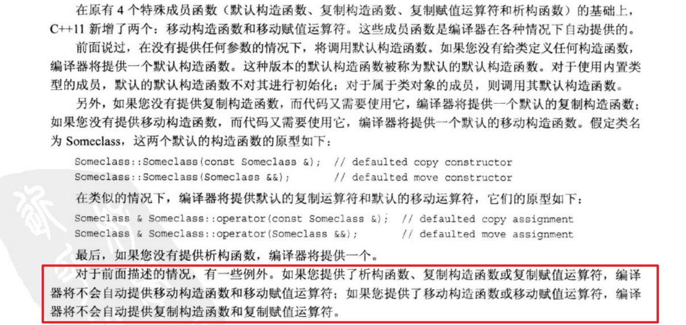
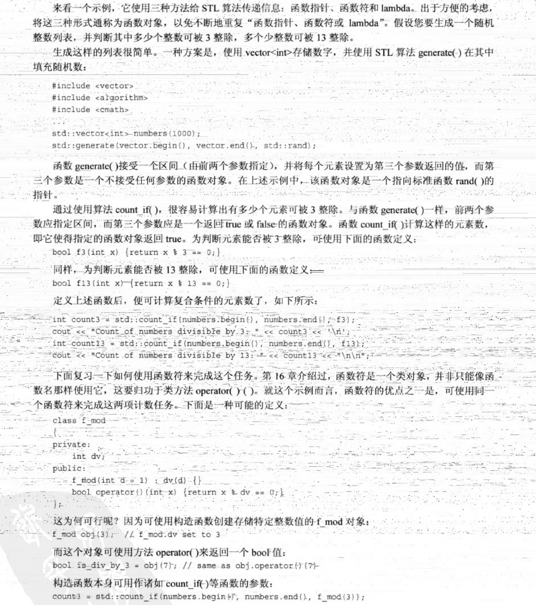

- [TODO](#todo)
- [第 18 章 探讨 C++ 新标准](#第-18-章-探讨-c-新标准)
  - [复习前面介绍过的 C++11 功能](#复习前面介绍过的-c11-功能)
    - [新类型：](#新类型)
    - [统一的初始化：](#统一的初始化)
    - [声明](#声明)
    - [智能指针](#智能指针)
    - [异常规范方面的修改](#异常规范方面的修改)
    - [作用域内枚举](#作用域内枚举)
    - [对类的修改](#对类的修改)
    - [模板和 STL 方面的修改](#模板和-stl-方面的修改)
    - [右值引用](#右值引用)
  - [移动语义和右值引用](#移动语义和右值引用)
    - [为何需要移动语义](#为何需要移动语义)
    - [一个移动示例](#一个移动示例)
    - [移动构造函数解析](#移动构造函数解析)
    - [赋值](#赋值)
    - [强制移动](#强制移动)
  - [新的类功能](#新的类功能)
    - [特殊的成员函数](#特殊的成员函数)
    - [默认的方法和禁用的方法](#默认的方法和禁用的方法)
    - [委托构造函数](#委托构造函数)
    - [继承构造函数](#继承构造函数)
    - [管理虚方法：override 和 final](#管理虚方法override-和-final)
  - [Lambda 函数](#lambda-函数)
    - [比较函数针、函数符和 Lambda 函数](#比较函数针函数符和-lambda-函数)
    - [为何使用 lambda](#为何使用-lambda)
  - [包装器](#包装器)
    - [包装器 function 及模板的低效性](#包装器-function-及模板的低效性)
    - [修复问题](#修复问题)
  - [可变参数模板](#可变参数模板)
    - [模板和函数参数包](#模板和函数参数包)
    - [展开参数包](#展开参数包)
    - [在可变参数模板函数中使用递归](#在可变参数模板函数中使用递归)
  - [C++11 新增的其他功能](#c11-新增的其他功能)
    - [并行编程](#并行编程)
    - [新增的库](#新增的库)

---

### TODO

---

### 第 18 章 探讨 C++ 新标准

#### 复习前面介绍过的 C++11 功能

##### 新类型：

##### 统一的初始化：

##### 声明

（注：有`int x;` 则`(x)`的类型为 `int &`）

##### 智能指针

##### 异常规范方面的修改

##### 作用域内枚举

##### 对类的修改

##### 模板和 STL 方面的修改

##### 右值引用

#### 移动语义和右值引用

##### 为何需要移动语义

##### 一个移动示例

##### 移动构造函数解析

##### 赋值

##### 强制移动

#### 新的类功能

##### 特殊的成员函数

##### 默认的方法和禁用的方法

##### 委托构造函数

##### 继承构造函数

##### 管理虚方法：override 和 final

#### Lambda 函数

##### 比较函数针、函数符和 Lambda 函数

##### 为何使用 lambda

#### 包装器

##### 包装器 function 及模板的低效性

##### 修复问题

#### 可变参数模板

##### 模板和函数参数包

##### 展开参数包

##### 在可变参数模板函数中使用递归

#### C++11 新增的其他功能

##### 并行编程

##### 新增的库

