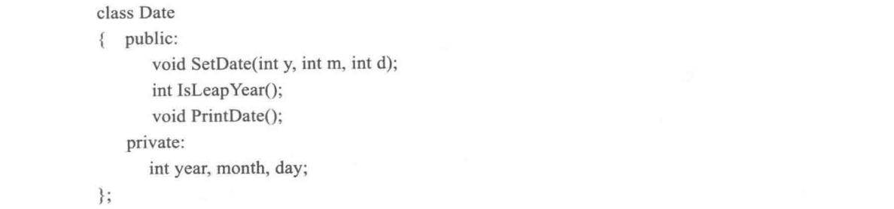
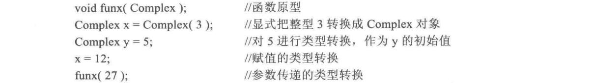
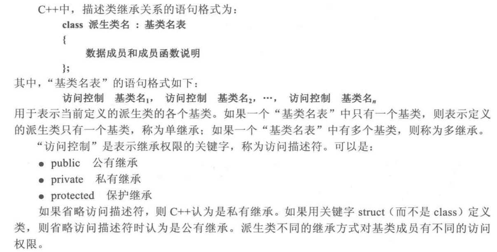

- [第一章 基本数据与表达式](#第一章-基本数据与表达式)
  - [程序的编译执行](#程序的编译执行)
  - [C++语言常用的关键字](#c语言常用的关键字)
  - [C++语言的数据类型](#c语言的数据类型)
  - [c++语言基本数据类型](#c语言基本数据类型)
  - [访问变量](#访问变量)
  - [引用](#引用)
  - [指向常量的指针](#指向常量的指针)
  - [指针常量](#指针常量)
  - [指向常量的指针常量](#指向常量的指针常量)
  - [常引用](#常引用)
  - [运算符](#运算符)
  - [赋值表达式](#赋值表达式)
  - [逗号表达式](#逗号表达式)
  - [输入输出](#输入输出)
- [第二章 程序控制结构](#第二章-程序控制结构)
  - [赋值表达式用于判断](#赋值表达式用于判断)
- [第三章 函数](#第三章-函数)
  - [函数原型](#函数原型)
  - [函数参数的传递](#函数参数的传递)
  - [实际参数求值的副作用](#实际参数求值的副作用)
  - [默认参数](#默认参数)
  - [指针参数](#指针参数)
  - [引用参数](#引用参数)
  - [函数的返回类型](#函数的返回类型)
  - [函数地址](#函数地址)
  - [函数的类型](#函数的类型)
  - [函数指针](#函数指针)
  - [内联函数](#内联函数)
  - [重载函数](#重载函数)
  - [变量存储特性与标识符作用域](#变量存储特性与标识符作用域)
  - [自动存储](#自动存储)
  - [静态存储](#静态存储)
  - [全局变量和局部变量](#全局变量和局部变量)
  - [多文件程序结构](#多文件程序结构)
  - [条件编译](#条件编译)
  - [多文件程序使用全局变量](#多文件程序使用全局变量)
  - [命名空间](#命名空间)
  - [使用命名空间](#使用命名空间)
- [第四章 数组](#第四章-数组)
  - [一维数组](#一维数组)
  - [指针数组](#指针数组)
  - [指向数组的指针数组](#指向数组的指针数组)
  - [指向函数的指针数组](#指向函数的指针数组)
  - [二维数组](#二维数组)
  - [数组名作为函数参数](#数组名作为函数参数)
  - [线性同余法生成随机数](#线性同余法生成随机数)
  - [动态存储](#动态存储)
  - [字符数组与字符串](#字符数组与字符串)
  - [字符串处理函数](#字符串处理函数)
  - [string 类](#string-类)
- [第五章 集合与结构](#第五章-集合与结构)
  - [位运算](#位运算)
  - [集合](#集合)
  - [结构](#结构)
- [第六章 类与对象](#第六章-类与对象)
  - [构造函数和析构函数](#构造函数和析构函数)
  - [复制构造函数](#复制构造函数)
  - [类的其他成员](#类的其他成员)
  - [静态成员](#静态成员)
  - [友元](#友元)
- [第七章 运算符重载](#第七章-运算符重载)
  - [重载运算符的限制](#重载运算符的限制)
  - [重载运算符的语法形式](#重载运算符的语法形式)
  - [用成员或友元函数重载运算符](#用成员或友元函数重载运算符)
  - [重载 ++ 与 --](#重载--与---)
  - [重载赋值运算符](#重载赋值运算符)
  - [重载运算符 \[\] 和 ()](#重载运算符--和-)
  - [重载流插入和流提取运算符](#重载流插入和流提取运算符)
  - [类类型转换](#类类型转换)
- [第八章 继承](#第八章-继承)
  - [基类和派生类](#基类和派生类)
  - [访问声明：](#访问声明)
  - [重名成员](#重名成员)
  - [派生类中访问静态成员](#派生类中访问静态成员)
  - [基类的初始化](#基类的初始化)
  - [多继承](#多继承)
  - [虚继承](#虚继承)
- [第九章 虚函数与多态性](#第九章-虚函数与多态性)
  - [类指针的关系](#类指针的关系)
  - [虚函数和动态联编](#虚函数和动态联编)
  - [虚函数的重载特性](#虚函数的重载特性)
  - [虚析构函数](#虚析构函数)
  - [纯虚函数和抽象类](#纯虚函数和抽象类)
- [第十章 模板](#第十章-模板)
  - [模板说明](#模板说明)
  - [函数模板与模板函数](#函数模板与模板函数)
  - [重载函数模板](#重载函数模板)
  - [类模板与模板类](#类模板与模板类)
  - [类模板作为函数参数](#类模板作为函数参数)
  - [在类层次中的类模板](#在类层次中的类模板)
  - [类模板与友元](#类模板与友元)
  - [类模板与静态成员](#类模板与静态成员)
  - [标准模板](#标准模板)
  - [容器](#容器)
  - [迭代器](#迭代器)
  - [算法](#算法)
- [第十一章 输入流/输出流](#第十一章-输入流输出流)
- [第十二章 异常处理](#第十二章-异常处理)
  - [C++ 的异常处理机制](#c-的异常处理机制)
  - [带异常说明的函数原型](#带异常说明的函数原型)
  - [再抛出异常传递](#再抛出异常传递)

---

### 第一章 基本数据与表达式

#### 程序的编译执行

- 把一个.cpp 文件编译成.exe 目标文件，要经过预处理、编译和连接 3 个步骤：预处理的作用是执行程序编译之前的准备，例如执行包含指令、宏替换命令；然后编译器对程序进行语法检查，如果发现语法错误，则显示错误信息，让程序员修改，直至正确，生成目标代码；最后把目标代码进行连接处理，往往还会加入一些系统提供的库文件代码。

#### C++语言常用的关键字

array bool break case catch char class const continue default delete do double else enum extern false float for friend goto if inline int long namespace new nullptr operator private protected public return short sizeof static struct switch template this throw true try typedef typename union unsigned virtual void while

#### C++语言的数据类型


- 空类型不是值意义可以直接解释的数据类型，它用于表示函数无返回值，或指针所指对象无结构。此时需要通过强类型转换才能解释数据。

#### c++语言基本数据类型


- 系统在内存存放字符串时，除了每个符号占一个字节外，还自动添加一个空字符'\0'作为串结束标志。所以，字符'x'和字符串"x"的数据类型和存储形式不一样。

#### 访问变量

- 内存单元由操作系统按字节编号，称为地址。当程序出现常量或变量说明语句时，编译器按类型分配存储空间，把地址写入标识符表。标识符就是获得分配的内存单元的名字。
- 一个指针变量如果仅作说明而不赋值，则它的值是不确定及无意义的。

#### 引用

- 引用说明为对象建立引用名，即别名。\&的意义是在定义时与对象名绑定，程序中不能对引用重定义。
- 一个对象的别名，在使用方式和效果上，与使用对象名一致。
- 引用仅仅是对象的别名，不开辟新的内存空间。这与对象指针不同。引用常常用于函数参数的传递。

#### 指向常量的指针

- 用 const 约束指针对所指对象访问时，这个指针称为指向常量的指针。定义形式：
  **const 类型 \* 指针** 或者 **类型 const \* 指针**
- c++语言为了保证标识常量的只读性，常量的地址只能赋给指向常量的指针。

#### 指针常量

- 指针常量的意义是指针变量的值只能在定义的时候初始化，定义后不能修改，即不能改变指针变量的指向。但不影响所指对象的访问特性。
- 指针常量的定义形式为：**类型 \* const 指针**

#### 指向常量的指针常量

- 指向常量的指针常量的定义形式为：
  **const 类型 \* const 指针** 或者 **类型 const \* const 指针**

#### 常引用

- 冠以 const 定义的引用，将约束对象用别名方式访问时为只读。常引用的定义形式为：
  **const 类型 & 引用名 = 对象名**

#### 运算符


#### 赋值表达式

- `(a = b) = 10` 首先应执行 a=b ， 把 b 的值写入 a，表达式的值确定于 a, 然后执行 a = 10。上式对 a 做了两次写操作， 对 b 做了一次读操作。

#### 逗号表达式

- 逗号表达式有两层含义：第一，各表达式按顺序执行；第二，逗号表达式也表达一个值，这个值是最后一个表达式的值。

#### 输入输出


---

### 第二章 程序控制结构

#### 赋值表达式用于判断

- 赋值表达式的值是被赋值变量的值，用于判断表达式中，首先完成赋值运算，然后以被赋值变量的值进行判断。

---

### 第三章 函数

#### 函数原型

- 函数原型是函数的声明，作用是告诉编译器有关函数接口的信息：函数的名字、函数返回值的数据类型、函数的参数个数、参数类型和参数的顺序，编译器根据函数原型检查函数调用的正确性。
- 由于函数原型没有实现代码，因此不需要参数名。这时，函数定义就具有函数原型的作用。

#### 函数参数的传递

- C++语言有三种参数传递机制：值传递（值调用）、指针传递（地址调用）和引用传递（引用调用 ）。实际参数和形式参数按照不同传递机制进行通信。

#### 实际参数求值的副作用

- C++没有规定在函数调用时实际参数的求值顺序。实际参数求值顺序的不同规定，对一般参数没有什么影响，但若实际参数表达式之间有求值关联，则同一个程序在不同编译器可能产生不同的运行结果。
  `cout << add(++x，x+y） << endl;`
  对于自左向右求实际参数的值的编译系统，首先计算 ++x，然后计算表达式 x+y
  但对于自右向左求实际参数的值的编译系统，首先计算 x+y，然后计算++x

#### 默认参数

有关默认参数的说明如下：

- C++规定，函数的形式参数说明中设置一个或多个实际参数的默认值， 默认参数必须是函数参数表中最右边（尾部）的参数。调用具有多个默认参数的函数时，如果省略的参数不是参数表中最右边的参数，则该参数右边的所有参数也应该省略。
- 默认参数应该在函数名第一次出现时指定，通常在函数原型中。若己在函数原型中指定默认参数，则函数定义时不能重复给出。
- 默认值可以是常量、全局变量或函数调用，但不能是局部量。
- 默认参数可以用于内联函数。

#### 指针参数

- 为了避免被调用函数对实参所指对象的修改，可以用关键字 const 约束形参指针的访问特性。

#### 引用参数

- 如果 C++ 函数的形式参数被定义为引用类型，则称为引用参数。引用参数对应的实际参数应该是对象名。函数被调用时，形式参数不需要开辟新的存储空间，形式参数名作为引用（别名）绑定于实际参数标识的对象上。执行函数体时，对形参的操作就是对实参对象操作。直到函数执行结束， 撤销引用绑定。
- 用常数作为实际参数时，C++规定，函数的 const 引用参数允许对应的实际参数为常数或者表达式。调用函数进行参数传递时将产生一个匿名对象保存实参的值。形参标识名作为这个匿名对象的引用，对匿名对象进行操作。匿名对象在被调用函数运行结束后撤销。

#### 函数的返回类型

- 如果函数定义的返回类型为基本数值类型，则执行 return 语句时，首先计算表达式的值，然后把该值赋给 c++ 定义的匿名对象。 匿名对象的类型是函数定义的返回类型。
- 函数被调用之后可以返回一个对象的指针值（地址表达式 ）。返回指针类型值的函数称为指针函数。指针函数的函数原型一般为：**类型 \* 函数名 （ 形式参数表 ）；**
- 注意，指针函数不能返回局部量的指针。返回对象可以是非局部对象或静态对象。
- C++ 函数返回对象引用时，不产生实际返回对象的副本，返回时的匿名对象是实际返回对象的引用。返回引用比返回指针更直接，可读性更好。
- 函数返回引用，使得函数调用本身是对象的引用，就像返回对象的标识别名。所以，返回引用的函数调用可以作为左值。

#### 函数地址

- 函数、应用程序是编译器处理的对象。每个函数的语句序列经过编译之后，生成的都是二进制代码。这些代码要调入内存才能够运行。每条指令、每个函数模块都有一个首地址。
- 一个己经定义的函数，它的名字就是函数的入口地址。
- 编译器调用函数不需要区分地址和名。对于一个己经定义的函数，函数名、函数地址（指针）、函数指针所指对象都是同一样东西，表示函数的入口地址。

#### 函数的类型

- 函数的类型（注意，不是函数的返回值类型）是指函数的接口，包括函数的参数定义和返回类型。
- 一般地，表示函数类型的形式为：**类型 （ 形式参数表 ）**
- C++中，可以用关键字 typedef 定义函数类型名。函数类型名定义的一般形式为：**typedef 类型 函数类型名 （ 形式参数表 ）**

#### 函数指针

- 要定义指向某一类函数的指针变量，可以用以下两种说明语句：
  **类型 （ \* 指针变量名 ） （ 形式参数表 ）**
  **函数类型 \* 指针变量名**

#### 内联函数

- 若 inline 不在函数名第一次出现时指定，则编译器把它作为普通函数处理。
- 一般内联函数只适合于 1 ～ 5 行的小程序。在内联函数中，不能含有复杂的流程控制语句。
- 递归函数不能说明为内联函数。

#### 重载函数

- C++ 编译器只根据函数参数表（参数类型和个数）进行重载版本的调用匹配，函数返回值的内容不起作用。
- 另外，要注意重载函数中使用默认参数时可能产生的二义性。

#### 变量存储特性与标识符作用域

- 一个被说明的变量，除名字、类型和值的基本特性外，还有其他特性，包括存储、作用域、可见性和连接等特性。
- 标识符存储特性确定了标识符在内存中的生存时间和连接特性。
- 标识符作用域是指在程序正文中能够引用这个标识符的那部分区域。
- 如果一个标识符在作用域的某部分程序正文区域中能够被直接引用，则称标识符在这个区域中可见。
- c++ 的一个应用程序称为一个项目。一个项目可以由多个文件组成。标识符的连接特性决定标识符能否被工程中的其他文件引用。

#### 自动存储

- 自动存储用关键字 auto 和 register 说明。**只有变量具有自动存储特性**。 这种变量在进入说明的块时生成，在结束块时删除。
- 函数的参数和局部变量都是自动存储的。C++ 把变量默认为自动存储，所以关键字 auto 很少用。
- 关键字 register 说明把变量存放在寄存器中。如今，C++ 的优化编译器能够识别经常使用的变量。

#### 静态存储

- 关键字 extern 和 static 说明静态存储变量和函数标识符。全局说明的标识符默认为 extern。
- 如果这两个关键字用于说明变量，程序在开始执行时就分配和初始化存储空间；
- 如果用于说明函数，表示从程序执行开始就存在这个函数名。
- 尽管标识符被说明为静态时，程序一开始执行就存在，但不等于它们在整个程序中可用。用 static 说明的局部变量只能在定义该变量的函数体中使用。
- 与自动变量不同的是，static 在第一次使用时进行初始化（默认初始化值为 0）。函数退出时，系统保持其存储空间和数值。下次调用这个函数时，static 变量还是上次退出函数时的值。

#### 全局变量和局部变量

- 具有文件作用域的变量称为全局变量，具有块作用域的变量称为局部变量。全局变量说明时默认初始值为 0 。当局部量与全局量同名时，在块内，全局量被屏蔽。要在块内访问全局量，可以用作用域运算符 “::”

#### 多文件程序结构

- 程序员经常使用两类文件：扩展名为 .h 的头文件和扩展名为 .cpp 源程序文件。
- 一个能够表达特定程序功能的模块由两部分构成：规范说明和实现部分。规范说明描述一个模块与其他模块的接口，一般包括：函数原型、类说明、类型说明、全局量说明、包含指令、宏定义 、注释等。
- 规范说明通常集中在头文件，各模块通过头文件的接口产生引用。实现部分则放在 .cpp 文件中，通常称为实现文件。

#### 条件编译

形式 3：

```c++
#ifndef 标识符
#define 标识符
程序文本
#endif
```

- 若 “标识符” 没有定义，则 “程序文本” 被编译；若 “标识符” 己经定义，则 “程序文本” 被忽略。
- 第 3 种形式的条件编译通常用于多文件结构的头文件中，避免 include 指令嵌入文本导致联编时出现重定义的错误。例如，为了方便起见，头文件会有一些变量说明、函数代码的定义。如果一个 .cpp 文件中己经有了这些定义，则直接包含头文件会产生重定义错误。在头文件中使用条件编译指令，起编译时阻隔作用。
- 声明语句是可以在同一个文件中重复出现的（定义语句不行）。
- 为避免多文件结构的重定义错误，除了在头文件中使用条件编译指令外，还应该尽量做到声明和定义分离，在头文件中只写数据类型、函数原型声明，把变量的定义和函数定义放在 .cpp 文件中，养成良好的程序书写习惯。

#### 多文件程序使用全局变量

- 在所有函数之外定义的全局变量在默认情况下具有静态存储特性。
- 全局变量可以被同一个文件中该变量说明之后的所有函数访问。程序的其他文件也能够访问全局变量，但必须在使用该全局变量的每个文件中用关键字 extern 予以声明。
- 函数原型默认为 extern，即一个文件中只要声明了函数原型，函数定义就可以放在同一个文件或另外的文件中。例如，用 include 指令把函数原型嵌入当前文件之后，程序员就不需去关心函数定义的位置了。
- 如果希望全局变量或函数的作用范围限制在定义它的文件中，可以使用存储说明符 static。

#### 命名空间

- C++ 语言标准头文件没有扩展名。使用标准类库的组件时，需要指定名空间。
- 如果不用 using 声明名空间，则需要在使用时指定组件的名空间。
- 若包含标准名空间没有定义的头文件，则不能省略扩展名。

#### 使用命名空间

- using 语句有两种形式：
  **using namespace 名空间 ；**
  **using 名空间 = 元素 ；**

---

### 第四章 数组

#### 一维数组

- 在计算机中，一个数组在内存中占有一片连续的存储区域，C++ 的数组名就是这块存储空间的地址。数组的每个元素都用下标变量标识。数组要求先定义后使用。
- 一维数组的说明格式为：**类型 标识符 [ 表达式 ]；**
- “[ ]” 是数组类型符，用于说明 “标识符” 的类型。
- 数组说明的作用是在程序运行前分配内存空间。编译程序要确定数组的大小，所以类型符必须己经定义，下标表达式也必须有确定值，不能为变量名，也不能为浮点型表达式。
- 说明一个数组变量后， c++ 数组元素的值是内存的随机状态值。数组可以在定义的同时进行初始化。形式为：以一对花括号给出常量值表，系统按下标顺序（ 存储顺序 ）对数组元素进行初始化。给定常数的个数不能超过数组定义的长度。如果给定常数的个数不足，则系统对其余元素初始化为 0 值。
- 只有定义静态数组， C++ 才会自动把各元素值初始化为 0 。
- C++ 不会对数组元素的下标表达式作界限检查，操作出界时可能会引起意想不到的错误。
- a+i 和 p++ 计算的偏移单位是一个整型数据的长度。(int a[10]； int \*p=a；)

#### 指针数组

- 一个数组的元素可以是各种己定义的数据类型。当数组元素的类型为指针类型时，称为指针数组。使用指针数组便于对一组相关对象的地址进行管理。
- 指针数组说明形式为： **类型 \* 标识符 [ 表达式 ]；**

#### 指向数组的指针数组

- 当指针数组元素存放数组地址时，可以通过这个指针数组访问这些数组的元素。
  
  （注：pf[0]可以指向 double 基本类型，也可以指向 double[]数组）

#### 指向函数的指针数组

- **int()**表示返回整型值的无参函数类型, 旨向该类型函数的指针类型是：**int (\*)()**； 指向该类型函数的指针数组类型是：**int(\*[])()**；定义一个上述类型的指针数组如：**int (\*pfun[3])()**
- 可以用关键字 typedef 定义函数类型， 然后说明指针数组：**typedef int fType();** **fType \*pfun[3];**
- (不存在指向函数数组的指针吗？)

#### 二维数组

- 二维数组的说明格式为： **类型 数组名 [ 表达式 1 ] [ 表达式 2 ]；**
  int am[2][3] = {{1,2,3},{3,4,5}};
  int am[2][3] = {1,2,3,4,5,6};
  以上两种初始化方式是等价的。
- 利用初始化值表，可以省略高维数组的最高维长度说明，例如：`int ad[][3] = {1，2，3，4，5，6}；`
- 对于二维数组，不带下标的数组名是一个逻辑上的二级指针，所指对象是行向量，偏移量是一行元素的存储长度。带一个下标的数组名是一级指针，偏移量是一个元素的长度，它所指的对象是数组元素。
- 如果定义一个二维数组和二级指针变量 `int a[3][4]，**pp;` 不可以用 `pp=a; `因为 pp 的定义可以解读为： `int *(*pp);` 即指针 pp 的关联类型是 int\*。 而数组 a 的定义可以解读为： `int (a[3])[4];` a 是关联类型为 int[4] 的一维数组。
- `pp + i` 的偏移量是 `pp + sizeof(int*) * i;` 而 `a + i` 偏移量是 `a + sizeof(int[4]) * i;`
- 二级指针变量与二维数组名是有区别的。只有定义一个**指向一维数组的指针**，才可以操作逻辑上为二级指针的二维数组名。（二级指针中第一级指向数组或基本类型没有区别，**但第二级是有区别的**，若指向数组的话一级指针的偏移量会是数组的大小，若指向基本元素偏移量只是基本元素的大小）
  
  （注意 1：`int *a[3]` 和 `int (*a)[3]` 是不同的，前者是存储 int \*数据的一维数组，而后者是一个指向一维数组的指针）
  （注意 2：`int a[3]` 和 `int (\*a)[3]`的区别，前者 a 代表数组的首地址，后者 a 代表一个存储啊 a[3]首地址的变量）

#### 数组名作为函数参数

- 当数组名作为函数参数时，C++ 进行传地址处理。调用函数时，形参数组名接收实参数组的地址，函数通过形参指针对实参数组间接访问。

```c++
void f(int x[])
{
    printf("%d\n", sizeof(x)); // 8字节指针
    // 形式参数 x 虽然说明为：int x[], 但它不是一个真正的数组，而是一个指针类型的
    // 临时变量，用于存放实参数组 a 的地址。所以将一维数组形参 x 说明为整型指针是等价的，
    // 即int *x，可见，在函数 f 内是允许修改指针 x。
    // 例如，可以在函数体内用 x 指针移动方式访问数组。
}
int main()
{
    int a[] = {1, 2, 3};
    printf("%d\n", sizeof(a)); // 3*4=12字节数组
    // 实参 a 是编译时建立的数组，类型为：int[3]
    f(a);
}
```


#### 线性同余法生成随机数

- 随机数序列中的每个数 $r_k$ 可以按下列公式由它的前一个数计算出来：
  $r_k = (\text{multiplier} × r_{k-1} + \text{increment}) ％ \text{modulus}$
- 例如， 如果有：$r_k =  25173 × r_{k-1} + 13849 ）％\  65536$, 可以产生 65 536 个各不相同的整型随机数。

#### 动态存储

- C++ 使用 new 和 delete 操作符动态分配存储空间和动态释放己分配的存储空间。new 和 delete 的一般语法形式为：
  **指针变量 = new 类型**
  **delete 指针变量**
- new 操作符按照指定类型的长度分配存储空间，并返回所分配空间的首地址。“类型” 可以是任意类型，例如，基本数据类型，数组类型、结构类型、类类型，包括函数指针类型等，但不允许是函数类型。
- 如果需要申请动态数组，new 操作的 “类型” 使用数组类型，释放存储空间使用 delete[] 操作。
- delete 运算释放了指针变量所指的空间，并没有删除指针变量本身的存储单元和清除指针变量原来的值。一个好的编程习惯是，在 delete 操作之后，对指针变量赋 NULL。
- 由 new 分配的堆空间与普通变量不同，它没有名字，只能通过指针对堆空间进行间址方式访问。
- new 运算符申请基本类型空间时，可以用 “()” 对存储区赋初始值。如 `p = new int(89);`
- 动态分配数组: `pa = new int[len];`

#### 字符数组与字符串

- 为了表示一个字符串的结束位置，可以用 '\0' 作为标记，在程序处理中，检测到 '\0'，就认为一个字符串结束了。
  
- C++ 对串常量自动添加结束标志 '\0'。
- 用字符指针管理串： `char \*string = "Student"；`对字符指针可以用串常量初始化，实际上系统完成两步操作：首先申请堆空间，然后填入串值。（str3 是常指针，而 string 是可以作为左值的指针变量）
- 指针数组存储字符串：`char \*name[5] = { "Chen Ming" ， "Li Ying" ， "Zhang Xiao jian" ， "Huang Qiang" ， "He Yong fei" }；`
  
- 

#### 字符串处理函数


#### string 类

- C++ 标准库（STL，standard Template Library）中定义了一个 string 类，封装了字符串的基本特性和对字符串各种典型操作，并重载一批运算符，使得字符串操作变得直接、简洁。类的各种操作都设置了下标范围和长度检查，提高了操作的安全性。
  
  

---

### 第五章 集合与结构

#### 位运算

- 
- 变量 a 用 b 进行两次异或运算，不会改变原来的值。（a 和 b 异或的结果，再和 a 异或得到 b，和 b 异或得到 a）
  
  
- 位运算要求的操作数类型是整型，实际上，C++ 按位操作数据，不会用类型解释存储单元中的数据值。若要交换浮点型变量的数据，可以用指针方式分段处理数据。这个思路同样适用于快速处理大批量数据。
  

#### 集合


#### 结构

- 说明结构变量的同时可以进行初始化，例如：
  `Employee worker={"Wang Li"，991083456，200.5，"Guang_Zhou"，"87111111"}；`
- 访问结构变量成员使用圆点运算符：**结构变量名.成员**
- 如果用指针访问结构，所指对象包含了结构的数据成员，则访问形式为：**\*(指针).成员** 或 **指针->成员**
- 假如 pp 是结构类型指针，若执行 pp++，则偏移量是一个结构的长度 0。
- 类型相同的结构变量可以使用赋值运算。所谓 “ 类型相同的变量 ”，是指用同一个类型标识 符说明的变量。

---

### 第六章 类与对象

- 结构类型的数据成员和普通类型一样，在建立变量时没有初始化机制；类定义解决了对数据和操作的封装及对对象的初始化问题。
- C++中，类定义的说明语句一般形式为：
  
- 除了 class 外，关键字 struct 也可以用于定义类。用 struct 定义类时，若不特别指出，则所有成员都是公有的。
- 一个日期类的说明如下：
  
  类的说明语句中没有给出函数的实现，成员函数在类外定义使用作用域区分符进行说明，此时函数头的形式为： **返回类型 类名::函数名 （ 参数表 ）**
  其中，作用域区分符由两个冒号构成，它用于标识属于什么类的成员。
  Date 类的成员函数定义在类外写为：
  
- 简单的成员函数实现可以在类中定义，此时，编译器作为内联函数处理。
- C++ 为成员函数提供了一个称为 this 的隐含指针参数。this 指针是一个常指针。

#### 构造函数和析构函数

- 构造函数名与类名相同。构造函数可以有任意类型的参数，但不能有返回类型。
- 析构函数名是在类名之前冠以一个波浪号 ~。析构函数没有参数，也没有返回类型。析构函数在类对象作用域结束时自动调用。
  
- 以 const 作为函数原型的后缀，称为常成员函数。
- 对象的构造次序和析构次序是相反的，首先创建的对象将最后析构。
- 如果对象是由 new 运算符动态创建的， delete 运算会自动调用析构函数。
- 像所有 C++ 函数一样，构造函数可以具有默认参数。但是，定义默认参数构造函数时，要注意调用时可能产生的二义性。例如：
  
  上述程序在说明 x 类对象 one 时，调用构造函数 `X::X(int i=0)；`但在说明 two 时，系统无法判断调用 `X::X()` 还是 `X::X(int i=0)`，因此会出现匹配二义性。

#### 复制构造函数

- 创建对象时，有时希望用一个己有的同类型对象的数据对它进行初始化。C++ 可以完成类对象数据的简单复制。用户自定义的复制构造函数用于完成更为复杂的操作。
- 复制构造函数要求有一个类类型的引用参数：**类名::类名 (const 类名 & 引用名，...);** 为了保证所引用对象不被修改，通常把引用参数说明为 const 参数。

```c++
A a(1);
A b(a); // 调用A(const A &)
A c=b; // 调用A(const A &)
```

- 调用复制构造函数的时机：当说明语句建立对象时，可以调用复制构造函数进行数据初始化。另外，当函数具有类类型传值参数或者函数返回类类型值时，都需要调用复制构造函数，完成局部对象的初始化工作。
- 复制构造函数实现深复制：
  

#### 类的其他成员

- **常成员**：在类中，定义常成员用 const 约束。常数据成员是指数据成员在实例化被初始化后约束为只读；常成员函数是指成员函数的 this 指针被约束为指向常量的常指针，在函数体内不能修改数据成员的值。
- **常数据成员**：用构造函数参数初始式实现常数据成员值的初始化是必需的。
  
  （注：Mclass: M(x)中 x 可以是构造函数的参数）
- **常对象**：若在定义对象的说明语句以 const 作前缀，则该对象称为常对象。这个对象的全部数据成员在作用域中约束为只读。
- **常成员函数**：常成员函数的 this 指针被约束为指向常量的常指针。由于 this 指针隐含定义，因此常成员函数在函数头以关键字 const 作为后缀。

#### 静态成员

- 当类成员冠以 static 声明时，称为静态成员。“静态” 是指它的作用域局部于类。一个类可以创建多个对象，因此，静态成员提供了一种同类对象的共享机制：“成员” 是指它与普通类成员一样受不同访问特性的约束。
- **静态数据成员**：
  - **静态数据成员要求在类中声明，在类外定义**。尽管 static 数据成员从存储性质上是全局变量，但其作用域是类。static 数据成员在类外可以用 “类名::” 作为限定词，或通过对象访问。
  - 在类中，**声明 static 数据成员和其他数据成员一样，不会建立存储空间**。一般数据成员在说明对象时建立内存，但 static 数据成员的存储空间的建立不依赖于对象，即不论创建多少个对象，都不会创建 static 数据成员的存储空间。所以，**在类声明之外要有一个 static 数据成员的说明语句，让它在编译时建立内存并进行一次文件范围初始化**。若不指定初始化值， 则系统自动初始化为 0。\
    
    
  - 在类说明中，静态数据成员的声明不是定义，因此必须在类外定义，用以分配存储空间并进行初始化。上例中，类 counter 中声明了一个私有静态数据成员。
  - num 是私有成员，不能在 main 函数中直接访问，只能通过成员函数访问它。
  - 静态成员独立于对象存在，可以通过类或对象使用。在类中声明的关键字 public、private 或 protected 起访问约束作用。
- **静态成员函数**：当一个成员函数冠以 static 声明时，称为静态成员函数。静态成员函数提供了一个不依赖于类数据结构的共同操作，它没有 this 指针。因为静态成员函数只能访问类的静态数据成员，所以设计静态成员函数与静态数据成员可协同操作。

#### 友元

- 友元可以访问类的所有成员，包括私有成员。友元可以是一个普通函数、成员函数或者另一个类。
- 友元关系是非对称的，非传递的。除非特别声明，否则：F 是 A 的友元，但 A 不是 F 的友元；B 是 A 的友元，C 是 B 的友元，但 C 不是 A 的友元。
- **友元函数**：
  - 在一个类 A 中，如果将关键字 friend 冠于一个函数原型或类名之前，则该函数或类成为类 A 的友元。**友元不受在类中声明位置（private、protected 或 public）的影响，它仅仅声明类 A 的一个友元**。例如：
    
  - 友元函数不是类的成员，它通过参数访问对象的私有成员。调用方法也有差别，例如：
    
    友元函数 FriendFun 必须在参数表中显式地指明要访问的对象 Aobj，而成员函数 MemberFun 则在它的对象 Aobj 上操作。
    
- **友元类**：
  - 若 F 类是 A 类的友元类，则 F 类的所有成员函数都是 A 类的友元函数。在程序中，友元类通常设计为一种对数据操作或类之间传递消息的辅助类。
    
  - 组合类成员的访问受成员特性的制约。如果在本例的 main 函数中有语句：`cout<<Bobject.Aobject.x<<endl;` 则会出现编译错误。因为 Aobject 是 B 类的私有数据成员，不能在 main 函数中访问。但如果在 B 类中声明 Aobject 为公有成员：`public: A A0bject;` 则上述输出语句合法，Bobject 作为友元可以访问 Aobject 的私有数据成员 x。
  - B 类的函数也可以通过参数形式获取 A 类对象参数，达到访问 A 类成员的目的。
    
- **类的包含**：
  - 一个类中含有己经定义的类类型成员，建立对象时，若希望通过带参数的构造函数对数据成员进行初始化，则必须使用特定的语法形式。首先要调用成员类的构造函数，然后执行自身的构造函数完成初始化操作。
    
  - 带参数的构造函数使用 “参数初始式” 调用类成员的构造函数（或基类构造函数，参见第 8 章）对数据成员置初值，也可以对自身数据成员赋值。其形式为：**构造函数名（变元表）：数据成员 1（变元表），... ， 数据成员 n（变元表）{...}**
  - 参数初始式列表就是在构造函数的参数表之后加一个冒号，冒号后面用逗号分隔，以括号指定每个数据成员对应的初始化变元。

---

### 第七章 运算符重载

#### 重载运算符的限制

- C++ 语言中大部分预定义的运算符都可以被重载。以下列出可以重载的运算符：
  
- 运算符重载后，原有的基本语义不变，不改变运算符的优先级，不改变运算符的结合性，不改变运算符所需要的操作数。不能创建新的运算符，只有系统预定义的运算符才能被重载。

#### 重载运算符的语法形式

- 运算符函数是一种特殊的成员函数或友元函数。 成员函数的语句格式为：
  **类型 类名:: operator op( 参数表 ）;**
- 用于类运算的运算符通常都要重载。但有两个运算符系统提供默认重载版本：
  - 赋值运算符 "="，系统默认重载为对象数据成员的复制；
  - 地址运算符 "&"，系统默认重载为返回任何类对象的地址。

#### 用成员或友元函数重载运算符

- 运算符函数既可以重载为成员函数，也可以重载为友元函数或普通函数。
- 使用非成员、非友元的普通函数重载访问 private 和 protected 数据成员时，必须通过 public 接口提供的函数实现。
- 成员函数具有 this 指针，而友元函数没有 this 指针。
  
  
- 用友元函数重载运算符：有时，运算符的左、右操作数类型不同，用成员函数重载运算符会碰到麻烦。
  
  如果用友元函数重载运算符，左、右操作数都由参数传递，则 C++ 语言可以通过构造函数实现数据类型隐式转换。
  
  
- 当一个运算符的操作需要修改类对象状态时，应该以成员函数重载。例如，需要左值操作数的运算符（如=、\*=、++等）应该用成员函数重载。如果以友元函数重载，则可以使用引用参数修改对象。
- 如果希望运算符的操作数（尤其是第一个操作数）有隐式转换，则重载运算符时必须用友元函数或普通函数。
- C++ 中不能用友元函数重载的运算符有： = () [] ->

#### 重载 ++ 与 --

- C++ 规定，前置形式重载为一元运算符函数，后置形式重载为二元运算符函数。
  前置：**A &A::operator++();** 或 **friend A &operator+(A &);**
  后置：**A &A::operator++(int)** 或 **friend A & operator+(A &，int)；** （第二个参数 int 一般取 0）
  

#### 重载赋值运算符

- 赋值运算符重载用于对象数据的复制，只能用成员函数重载。重载函数原型为：
  **类名 & 类名 :: operator= ( 类名 )；**
  
  
- 注意，重载赋值运算符函数和复制构造函数的实现十分相似。不同的是，重载函数返回 \*this ，以符合语言版本的原有赋值语义。
- c++ 提供系统版本的重载赋值运算，实现数据成员的简单复制。这一点和浅复制的操作一样。
- 运算符函数 operator= 产必须重载为成员函数，而且**不能被继承**。

#### 重载运算符 [] 和 ()

- 运算符 “ [] ” 和 “ () ” 只能用成员函数重载，不能用友元函数重载。
- 注意，程序中重载运算符函数：`int & operator[](int i) const;`返回 `int&`，原因是，需要函数调用作为左值，以符合下标运算的语义，在赋值表达式 `A[i] = i + 1` 中， `A[i]` 作为左值操作合法。所以，当重载运算符函数调用需要作为左值时，应该返回引用。

#### 重载流插入和流提取运算符

- 运算符 “ << ” 和 “ >> ” 在 c++ 的流类库中重载为插入和提取操作，用于输出和输入标准类型的数据和字符串。程序员也可以重载这两个运算符，通常用于传输用户自定义类型的数据。
- 注意，函数 operator<< 和 operator>> 被声明为用户类的友元，是因为要把用户类对象作为运算符的右操作数，即引起调用函数的是流类对象 cin 或 cout，而不是用户类的对象。所以，这两个运算符的重载函数必须为非成员函数。

#### 类类型转换

- 使用构造函数和类型转换函数。与基本类型的转换相同，有隐式调用和显式调用两种方式。
- **构造函数进行类类型转换**：
  - 具有一个非默认参数的构造函数实现从参数类型到该类类型的转换。这种类型转换是隐式的。它与基本类型数据运算时的类型转换情况相仿，转换可以发生在算术运算、赋值运算及函数参数传递中。例如：
    
    从类型转换语句的语法形式上看，它们很不一样，但实际上都是调用带参数的构造函数实现类型转换。
- **类型转换函数**：

  - 类型转换函数的形式为：

    ```c++
      ClassX::operator Type()
      {
        // ...
        return Type_VaIue;
      }
    ```

  - 这个函数的功能是把 ClassX 类型的对象转换成 Type 类型的对象。类型转换函数没有参数，没有返回类型，但必须有一个返回 Type 类型值的语句。
  - 类型转换函数只能定义为一个类的成员函数，不能定义为类的友元的函数。
  - 用户定义的类型转换函数只能在无二义性的情况下才能够隐式使用。**类型转换函数没有参数，所以不能被重载。但它可以被继承， 可以是虚的。**

---

### 第八章 继承

#### 基类和派生类



- 派生类对基类成员的使用，除了与类定义的继承访问控制有关外，还与基类中的成员性质有关。
- 一个派生类公有继承一个基类时，基类中所有公有成员（由 public 定义的数据成员或成员函数）成为派生类的公有 (public) 成员，基类中所有保护成员（由 protected 定义的数据成员或成员函数 ）成为派生类的保护（ protected ）成员。
- 一个派生类私有继承一个基类时，基类中所有公有成员和保护成员同时成为派生类的私有（ private ）成员。
- 一个派生类保护继承一个基类时，基类中所有公有成员和保护成员同时成为派生类的保护（ protected ）成员。
- 不论派生类以何种方式继承基类，都不能直接使用基类的私有（ private ）成员。
- 基类的私有成员在派生类中不可见，但并不是说在建立派生类对象时，就不创建从基类继承的私有数据成员。（b.A::out() 可以通过 a 的公有方法 out 访问基类的私有成员 x）
- 建立一个派生类对象时，不管类层次有多深，都必须从最高层（ 根 ）的基类开始初始化，建立所有数据成员。

#### 访问声明：

- c++ 提供一种访问调节机制，使一些本来在派生类中不可见的成员变为可访问的。在例 8-3 中（get_XY 是 A 的公有成员方法），为了保持 get_XY 在类 B 中依然是公有的，可以修改声明如下：
  
- 访问声明的格式为：**基类名::成员**
- **访问声明仅调整名字的访问权限**。当被声明对象是数据成员时，不可说明为任何类型；当被声明对象为成员函数时，只能是函数名本身，不能带参数和返回类型说明。例如：
  
- **访问声明不允许在派生类中降低或提升基类成员的可访问性**。例如：
  
  
- **对重载函数名的访问声明将调整基类所有同名函数的访问域**。
  

#### 重名成员

- 
- 
  
  
- 基类成员在派生类中都具有作用域。相反，由于继承关系的非对称性，基类不具备派生类中所定义的成员的作用域。

#### 派生类中访问静态成员

- 如果在基类中定义了静态成员，这些静态成员将在整个类体系中被共享，根据静态成员自身的访问特性和派生类的继承方式，在类层次体系中具有不同的访问性质。
  
  

#### 基类的初始化

- 通过派生类的构造函数将指定参数传递给基类的带参数构造函数，从而初始化派生类从基类继承的数据成员。派生类的构造函数使用冒号语法的参数初始式实现这种功能:
  **构造函数名（变元表）：基类（变元表），数据成员 1（变元表），... ，数据成员 n（变元表）**
- 构造函数的执行顺序是：首先执行基类，然后执行类对象成员，最后执行派生类本身。如果有间接基类，则首先执行间接基类构造函数。它们的执行顺序是由系统规定的，与参数初始式列表安排无关。参数初始式列表的任务只是传递参数。例如，用户可以把基类初始化 `“基类（变元表）”`放在最后，系统依然首先执行基类的构造函数，完成派生数据成员的初始化。
  
  

#### 多继承

- 多个基类的派生类构造函数可以通过继承路径调用基类构造函数，执行顺序与单继承构造函数情况类似。先执行基类构造函数，再执行子对象构造函数，最后执行本身的构造函数。由于多继承的派生类有多个直接基类，因此，它们的构造函数执行顺序取决于定义派生类时指定的各个继承基类的顺序，而与派生类构造函数成员参数初始式列表中给定的基类顺序无关。
- 一个派生类对象可以拥有多个直接或间接基类的成员。对于不同名的成员，访问不会出现二义性。但是，如果不同的基类有同名成员，派生类对象访问它们时就应该加以识别。

#### 虚继承

- C++ 中，一个类不能被多次说明为一个派生类的直接基类，但可以不止一次地成为间接基类。
- 非虚继承：
  
  类 B 两次成为类 D 的间接基类。这意味着，D 类对象将生成两份从 B 类继承的数据成员：由 B1 继承的 B 类成员和由 B2 继承的 B 类成员。因为在 D 类对象中有两个继承 B 类的成员副本，所以称 B 是非虚基类。
- 虚继承：虚继承的说明形式是在类继承的关键字之前添加关键字 virtual。
  

---

### 第九章 虚函数与多态性

- 在面向对象程序设计中，多态性（Polymorphism) 是指一个名字，多种语义：或者界面相同，多种实现。重载函数是多态性的一种简单形式。C++ 为类体系提供一种灵活的多态机制一一一虚函数（virtual function)。虚函数允许函数调用与函数体的联系在运行时才进行，称为动态联编。类、继承和多态，提供了对软件重用性和扩充性需要的卓越表达能力。

#### 类指针的关系

- 用基类指针引用派生类对象：在一般情况下，基类指针指向派生类对象时，只能引用基类成员。如果试图引用派生类中特有的成员， 则必须通过强制类型转换，把基类指针转换成派生类指针。
- 派生类指针只有经过强制类型转换之后，才能引用基类对象。

#### 虚函数和动态联编

- 冠以关键字 virtual 的成员函数称为虚函数。
- 实现运行时多态的关键是先要说明虚函数，而且必须用基类指针调用派生类的不同实现版本。
- 尽管可以像调用其他成员函数那样，显式地用对象名来调用一个虚函数，但**只有使用同一个基类指针访问虚函数，才称为运行时的多态。**
- 基类指针不需经过类型转换就可以指向派生类对象，这是一个重要的事实。但是，基类指针虽然可以获取派生类对象的地址，却只能访问派生类从基类继承的成员。
- C++ 提供的虚函数解释机制，让基类指针可以依赖运行时的地址值（当前指向）调用不同类版本的成员函数。实际上，这表达了一种运行时的动态性质。
- 定义虚函数时注意如下 4 点：
  - 一旦一个成员函数被说明为虚函数，则不管经历多少派生类层次，所有界面相同的重载函数都保持虚特性。
  - 虚函数必须是类的成员函数。不能将虚函数说明为全局（非成员）函数，也不能说明为静态成员函数。因为虚函数的动态联编必须在类层次中依靠 this 指针实现。
  - 不能将友元说明为虚函数，但虚函数可以是另一个类的友元。
  - 析构函数可以是虚函数，但构造函数不能是虚函数。

#### 虚函数的重载特性

- 在一个派生类中重定义基类的虚函数是函数重载的一种特殊形式，它不同于一般函数的重载。当重载一般函数时，函数的返回类型和参数的个数、类型可能不相同，仅要求函数名相同。但重载一个虚函数时，要求函数名、返回类型、参数个数、参数类型和顺序完全相同。否则，会出现以下问题：
  - 如果仅仅返回类型不同，其余相同，则 C++ 认为是错误重载，因为只靠返回类型不同的信息进行函数匹配是含糊的。
  - 如果函数原型不同，仅函数名相同，则 C++ 认为是一般函数重载，因而丢失虚特性。
- 究其原因，类层次重载的各个虚函数，表面上它们的类型相同（函数名、参数集相同），但隐含 this 指针类型不同，其关联类型分别是重载它们的派生类。虚函数是仅由 this 指针类型区分接口的函数，C++ 的 “虚” 特性仅负责在程序运行时把基类 this 指针的关联类型转换成当前指向对象的类类型，而不能改变函数其他参数的性质。

#### 虚析构函数

- 构造函数不能是虚函数。因为建立一个派生类对象时，必须从类层次的根开始，沿着继承路径逐个调用基类的构造函数，直至自身的构造函数，不能 “ 选择性地 ” 调用构造函数。
- 析构函数可以是虚的。虚析构函数用于动态建立类对象时，指引 delete 运算符选择正确的析构调用。
  
  

#### 纯虚函数和抽象类

- 一个具有纯虚函数的基类称为抽象类。抽象类机制支持一般概念的表示，也可以用于定义接口。
- **纯虚函数**：
  - 纯虚函数是在基类中说明的虚函数，它在该基类中没有实现定义，要求所有派生类都必须定义自己的版本。
  - 纯虚函数的说明形式如下：**virtual 类型 函数名 （ 参数表 ）= 0;** 其中，“函数名” 是纯虚函数名。该函数赋值为 0，表示没有实现定义。虚函数的实现在它的派生类中定义。
- **抽象类**：
  - 抽象类至少有一个纯虚函数。
  - 如果抽象类的一个派生类没有为继承的纯虚函数定义实现版本，那么，它仍然是抽象类。
  - 对应地，定义了纯虚函数实现版本的派生类称为具体类。
  - 对抽象类的使用，C++ 有以下限制：1、抽象类只能用作其他类的基类；2、抽象类不能建立对象；3、抽象类不能用作参数类型、函数返回类型或显式类型转换。
  - 可以说明抽象类的指针和引用。例如， 对 Figure 抽象类的使用：
    

---

### 第十章 模板

- 模板把函数或类要处理的数据类型参数化，表现为参数的多态性。在面向对象技术中，这 种机制称为类属。
- 模板用于表达逻辑结构相同但具体数据元素类型不同的数据对象的通用行为。模板是开发大型软件、建立通用函数库和类库的一个强有力的工具。
- 模板的类属参数由调用它的实际参数的具体数据类型替换，由编译器生成一段真正可以运行的代码。这个过程称为实例化。函数模板被类型实例化后，称为模板函数。类模板经过类型实例化后，称为模板类。

#### 模板说明

- 模板说明的一般形式可以写为：**template <typename T1，typename T2，...， typename Tn>**

#### 函数模板与模板函数

- 一般函数是对相同类型数据对象（不同值）操作的抽象。函数模板是对相同逻辑结构（不同数据类型）数据对象操作的抽象，是生成不同类型参数的重载函数的 “模板”。
- 函数模板定义由模板说明和函数定义组成。
  
  
  对函数模板的调用与对普通函数的调用在形式上没有区别。
- 图 10.1 给出了函数模板和模板函数的关系示意。这些重载函数，通过函数模板按实际类型生成，所以称为模板函数。这个过程称为实例化。
  

#### 重载函数模板

- 函数模板可以用多种方式重载。可以定义同名的函数模板，提供不同的参数和实现；也可 以用其他非模板函数重载。
- **函数模板的重载**：重载函数模板便于定义类属参数，或者由于函数参数的类型、个数不相同所进行的类似操作。例如，Max 函数模板可以重载为求数组最大元素的函数模板。
  
  
- **用普通函数重载模板**：函数模板实例化时，实际参数类型替换类属参数。虽然这种参数替换具有类型检查功能，通值参数的类型转换机制。例如，对函数模板：
  
- 编译器通过匹配过程确定调用哪个函数。匹配顺序如下：
  - 寻找和使用最符合函数名和参数类型的函数，若找到，则调用它;
  - 否则，寻找一个函数模板，将其实例化，产生一个匹配的模板函数，若找到，则调用它;
  - 否则，寻找可以通过类型转换进行参数匹配的重载函数，若找到，则调用它。
    如果按以上步骤均未能找到匹配函数，则这个调用是错误的; 如果这个调用有多于一个的匹配选择，则调用匹配出现二义性，也是错误的。

#### 类模板与模板类

- 类模板由模板说明和类说明构成
  
  类属参数必须至少在类说明中出现一次。
  
- 类模板的成员函数都是函数模板，实现语法和函数模板类似。如果在类中定义（作为 inline 函数），则不需要特别声明；如果在类外定义，则每个成员函数定义都要冠以模板参数说明，并且在指定类名时要后跟类属参数。
- 当类模板实例化时，成员函数同时实例化为模板函数。
  
  

#### 类模板作为函数参数

- 函数的形式参数类型可以是类模板或类模板的引用。调用时对应的实际参数是该类模板实例化的模板类对象。
- 当一个函数拥有类模板参数时，这个函数必定是函数模板。
  
  

#### 在类层次中的类模板

- 一个类模板在类层次结构中，既可以是基类，也可以是派生类，即：
  - 类模板可以从类模板派生或从普通类（非模板类）派生；
  - 模板类可以从类模板派生或普通类派生。
- 当一个类模板从普通类派生时，意味着派生类增加了类属参数；当一个模板类从类模板派生时，意味着派生类继承基类时提供了实例化的类型参数。
- 类模板从类模板派生:
  
  
- 若从一个类模板派生一个普通类，在定义这个派生类时就要对基类的类属参数实例化。
  

#### 类模板与友元

- 在类模板中，与普通类一样，可以声明各种友元关系：一个函数或函数模板可以说明为类或类模板的友元， 一个类或类模板可以说明为类或类模板的友元类。要声明这种模板之间的友元关系，由于既有模板声明，又有友元声明，所以使用的语法符号比较烦琐。
- **模板类的友元函数**：
  
- **模板类的友元类**：
  
  

#### 类模板与静态成员

- 从类模板实例化的每个模板类都拥有自己的特定类型的数据成员。若类模板中定义了静态数据成员，则实例化后的**每个模板类都有自己的静态数据成员**，该模板类的所有对象共享这个静态数据成员。
- 和非模板类的静态数据成员一样，类模板实例化的静态数据成员也应该在文件范围内定义和初始化。
- 同样道理，类模板的静态成员函数也是每个实例化后的模板类的公共操作。
  

#### 标准模板

- c++ 语言包含一个有许多组件的标准库。标准模板库（Standard Template Library，STL) 中有 3 个主要组件：容器（container)、迭代器（iterator）和算法（algorithm）。

#### 容器

- “容器” 是数据结构，按某种特定的逻辑关系把数据元素组装起来的数据集。例如，数组、队列、堆栈、树、图等数据结构中的每个结点都是一个数据元素。这些结构如果抽象了数据元素的具体类型，只关心结构的组织和算法，就是类模板了。STL 提供的容器是常用数据结构的类模板。
- STL 容器分成三大类：序列容器（sequence container)、关联容器（associative container）和容器适配器（container adapter)。另外，还有我们己经熟悉的 c 语言式数组和 string，它们也是一种容器，称为近容器（near container)。
  - 序列容器一一提供顺序表的表示和操作：
    - vector：向量。可以随机访问序列中的单个元素，在序列尾快速插入和删除元素。如果在序列中插入和删除元素，则时间与序列长度成正比。
    - deque：双向队列。随机访问序列中的单个元素，可以在序列头或尾快速插入和删除元素。如果在序列中插入和删除元素，则时间与序列长度成正比。
    - list：双向链表。用动态链式存放数据，可以从任何位置快速插入和删除元素。
  - 关联容器一一提供集合和映像的表示和操作：
    - set：集合。无重复值元素，可以快速查找。
    - multiset：集合。允许重复值元素，可以快速查找。
    - map：映射。一对一映射，无重复值元素，实现基于关键字的快速查找。
    - multimap：映射。一对多映射，允许重复值元素，实现基于关键字的快速查找。
  - 容器适配器一一特殊顺序表：
    - stack（堆栈）：后进先出（Last-In，First-Out，LIFO）表，只能在表头插入和删除元素。
    - queue（队列）：先进先出（First-In，First-Out，FIFO）表，只能在表头删除元素，在表尾插入元素。
    - priority-queue（优先队列）：优先级最高的元素总是第一个出列。
      
- 容器的接口：STL 经过精心设计，使容器提供类似的功能。许多一般化的操作对所有容器都适用，有些操作是为某些容器特别设定的。
  - 容器共同操作：其中，Container 表示容器类型，如 vector、 list；T 表示容器的实例化类型，如 int、double; c、c1、c2 表示容器对象。
    
    
  - 序列容器还有访问首位元素、随机访问元素的操作
    

#### 迭代器

- 迭代器是 STL 提供的对顺序容器和关联容器操作的模板，是功能更强更安全的容器指针。迭代器的对象保存所操作的特定容器对象需要的状态信息，从而可以适应不同的容器类型。
- 迭代器的分类：
  
  - 在 STL 容器类定义中，用 typedef 预定义了一些迭代器，如表 10.4 所示。
    
  - 通过迭代器的构造函数，可以定义各种容器的迭代器对象。迭代器对象常常称为迭代子或迭代算子。
    
    迭代子是指向容器类型指针变量 ， 用于操作容器的元素 。
- 迭代器的基本操作：
  
  

#### 算法

- C++ 的 STL 中包含大约 70 种标准算法。这些算法是用于对容器的数据施加特定操作的函数模板。迭代器的迭代子协同访问容器数据元素。
- 把容器和算法分开，似乎不符合面向对象程序设计的原则。STL 把算法与容器分开，是为了便于加入新的算法，由此也避免了虚函数调用的相关开销。STL 算法不依赖于所操作容器的实现细节。只要容器（或数组）的迭代器符合算法要求，STL 算法就可以像容器一样处理任何 C 语言式、基于指针的数组，以及用户自定义的数据结构。
- 按照对容器的访问性质，算法分为只读形式（即不允许修改元素）和改写形式（即修改元素）两种。从功能上，可以分为查找、比较、计算、排序、置值、合并、集合、管理及数值算法等。
  
  

---

### 第十一章 输入流/输出流

- c++ 程序的输入 / 输出（I/O，Input/Output）操作，是由 I/O 流类库提供对象之间的数据交互服务。流类库预定义了一批流对象，连接常用的外部设备，如键盘、显示器。程序员可以定义所需的 I/O 流对象，与磁盘文件、字符串等对象连接，使用流类库提供的工作方式，实现数据传输。流类库既支持高级（格式化）的 I/O 功能，也支持低级（无格式）的 I/O 功能。
- **TODO**

---

### 第十二章 异常处理

#### C++ 的异常处理机制

- 异常处理的基本思想是将异常检测与处理分离。出现异常的函数不需要具备处理异常的能力。当一个函数发生异常时，它抛出一个异常信息，希望它的调用者捕获并处理这个异常。如果调用者不能处理，还可以报告（抛出）给上一级调用者处理。这样，一直到运行程序的操作系统，若仍不能处理，将简单终止程序。
- C++ 的异常处理是一种不唤醒机制，即抛出异常的模块一旦抛出了异常，将不再恢复运行原来的程序模块，程序将在异常处理模块执行处理代码后继续执行。系统有序地释放调用链上的资源，包括函数调用栈的释放和调用析构函数删除己建立的对象 。
  
- 若 catch 语句不带参数，则括号内用省略号 “...” 表示该 catch 语句可以捕获处理任意类型的异常。
- throw 表达式 抛出异常。 “表达式” 表示一个异常的值，可以是任意类型的对象，包括类对象。
- 如果处理异常时不需要关心异常的参数值，则可以省略 catch 的参数名。

#### 带异常说明的函数原型

- 必要在函数原型中指定异常，或称为抛出列表（throw list）。
- 异常指定一方面显式地给出了一个函数抛出异常的界面，另一方面也限制了该函数抛出异常的类型。
- 指定异常：指定异常函数形式为：**T funName(parameterList) throw(T1，T2，···，Tn);** 该函数原型指定 funName 可以抛出的类型为 T1，T2，··· 的异常，也可以抛出这些类型的子类型的异常。若在函数体内抛出其他类型的异常，调用函数无法捕获，系统将调用 abort 函数终止程序。
- 不抛出异常：不抛出异常的函数形式为：**T funName(parameterList) throw ();** 函数原型的抛出列表是一个空表，表示该函数不抛出任何类型的异常。
- 抛出任意类型的异常：抛出任意类型异常的函数形式为：**T funName(parameterList);** 如果函数原型没有 throw 说明，则表示该函数可以抛出任意类型的异常。

#### 再抛出异常传递

- 如果异常处理程序捕获到异常后，还无法完全确定异常的处理方式，则需要把异常传递给上一层的调用函数。这时可以在异常处理程序中再用 throw 语句抛出该异常。一个异常只能在 catch 语句中再用 throw 语句抛出。
