### GAN

[TOC]

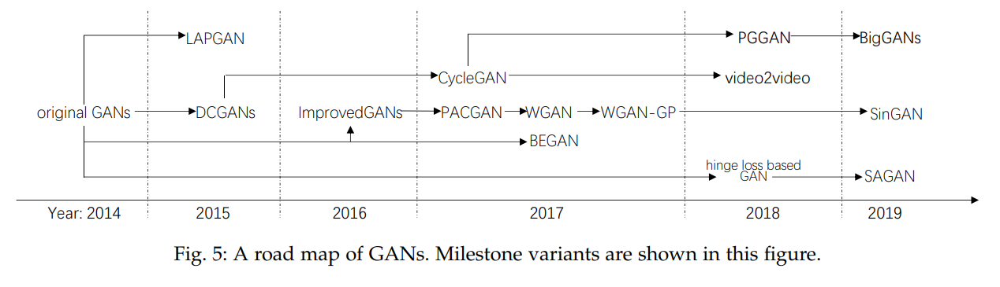

#### Vanilla GAN

##### Loss Function

$$
\min _{G} \max _{D} V(D, G)=\mathbb{E}_{\boldsymbol{x} \sim p_{\text {data }}(\boldsymbol{x})}[\log D(\boldsymbol{x})]+\mathbb{E}_{\boldsymbol{z} \sim p_{\boldsymbol{z}}(\boldsymbol{z})}[\log (1-D(G(\boldsymbol{z})))]
$$

这个损失函数把判别器和生成器的损失函数写在一个公式里了，分开来写就是

- 判别器需要最小化如下函数（其实就是两个交叉熵损失相加）

$$
-\mathbb{E}_{\boldsymbol{x} \sim p_{\text {data }}(\boldsymbol{x})}[\log D(\boldsymbol{x})]-\mathbb{E}_{\boldsymbol{x} \sim p_{\text{g}}(\boldsymbol{x})}[\log (1-D(\boldsymbol{x}))]
$$

- 生成器需要最小化如下函数
  $$
  \mathbb{E}_{\boldsymbol{x} \sim p_{\text{g}}(\boldsymbol{x})}[\log (1-D(\boldsymbol{x}))]
  $$
  Early in learning, when $G$ is poor, $D$ can reject samples with high confidence because they are clearly different from the training data. In this case, $\log(1 − D(G(z)))$ saturates. Rather than training $G$ to minimize $\log(1 − D(G(z)))$ we can train $G$ to maximize $\log D(G(z))$.

  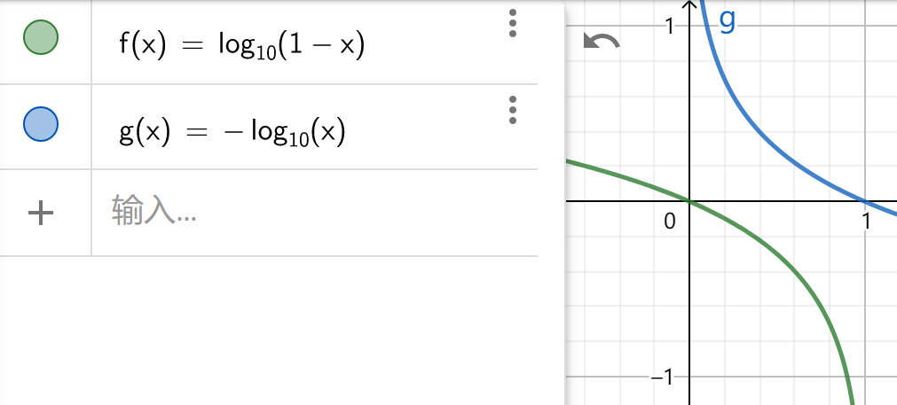

  训练$G$​的时候将最小化$\mathbb{E}_{\boldsymbol{x} \sim p_{\text{g}}(\boldsymbol{x})}[\log (1-D(\boldsymbol{x}))]$​改为最小化$\mathbb{E}_{\boldsymbol{x} \sim p_{\text{g}}(\boldsymbol{x})}[-\log (D(\boldsymbol{x}))]$​，也就是交叉熵损失

##### Train

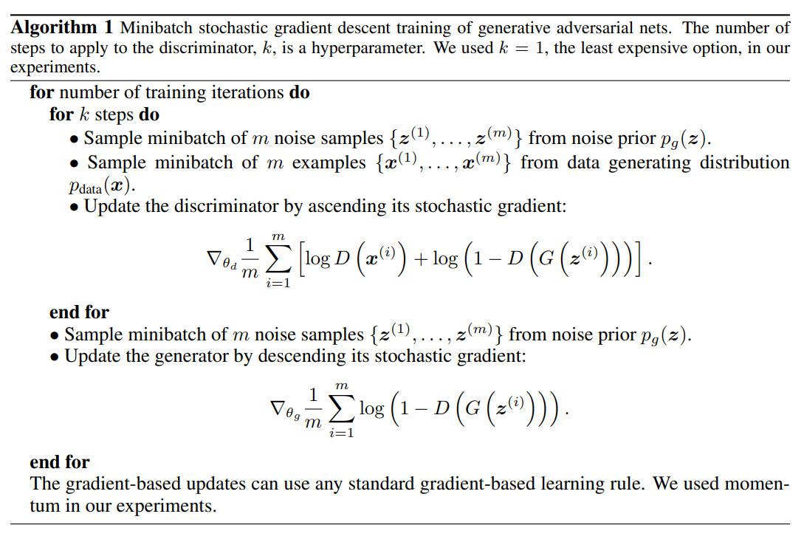

##### Optimal discriminator $D$ for any given generator $G$

**Proposition 1.** For $G$ fixed, the optimal discriminator $D$ is
$$
D_{G}^{*}(\boldsymbol{x})=\frac{p_{\text {data }}(\boldsymbol{x})}{p_{\text {data }}(\boldsymbol{x})+p_{g}(\boldsymbol{x})}
$$
**Proof.** The training criterion for the discriminator $D$, given any generator $G$, is to maximize the quantity $V(G, D)$
$$
\begin{aligned}
V(G, D) &=\int_{\boldsymbol{x}} p_{\text {data }}(\boldsymbol{x}) \log (D(\boldsymbol{x})) d x+\int_{z} p_{\boldsymbol{z}}(\boldsymbol{z}) \log (1-D(g(\boldsymbol{z}))) d z \\
&=\int_{\boldsymbol{x}} p_{\text {data }}(\boldsymbol{x}) \log (D(\boldsymbol{x}))+p_{g}(\boldsymbol{x}) \log (1-D(\boldsymbol{x})) d x
\end{aligned}
$$
因为我们要找的是一个最优判别器$D$，此时$p_{data}(x)$和$p_g(x)$是固定的，并分别用常数$a$，$b$表示，函数$D$不是固定的，我们要找的是一个能使$V$的值最大的函数$D$，$x$输入$D$可以得到任意值，所以用$y$表示$D(x)$​

For any $(a, b) \in \mathbb{R}^{2} \backslash\{0,0\}$, the function $y \rightarrow a \log (y)+b \log (1-y)$ achieves its maximum in
$[0,1]$ at $\frac{a}{a+b}$. The discriminator does not need to be defined outside of $\operatorname{Supp}\left(p_{\text {data }}\right) \cup \operatorname{Supp}\left(p_{g}\right)$, concluding the proof.

即
$$
\begin{aligned}
C(G) &=\max _{D} V(G, D) \\
&=\mathbb{E}_{\boldsymbol{x} \sim p_{\text {data }}}\left[\log D_{G}^{*}(\boldsymbol{x})\right]+\mathbb{E}_{\boldsymbol{z} \sim p_{\boldsymbol{z}}}\left[\log \left(1-D_{G}^{*}(G(\boldsymbol{z}))\right)\right] \\
&=\mathbb{E}_{\boldsymbol{x} \sim p_{\text {data }}}\left[\log D_{G}^{*}(\boldsymbol{x})\right]+\mathbb{E}_{\boldsymbol{x} \sim p_{g}}\left[\log \left(1-D_{G}^{*}(\boldsymbol{x})\right)\right] \\
&=\mathbb{E}_{\boldsymbol{x} \sim p_{\text {data }}}\left[\log \frac{p_{\text {data }}(\boldsymbol{x})}{P_{\text {data }}(\boldsymbol{x})+p_{g}(\boldsymbol{x})}\right]+\mathbb{E}_{\boldsymbol{x} \sim p_{g}}\left[\log \frac{p_{g}(\boldsymbol{x})}{p_{\text {data }}(\boldsymbol{x})+p_{g}(\boldsymbol{x})}\right]
\end{aligned}
$$

##### Optimal generator $G$ for optimized $D$

**Theorem 1.** The global minimum of the virtual training criterion $C(G)$ is achieved if and only if $p_g = p_{data}$. At that point, $C(G)$ achieves the value $−\log4$.

**Proof.**
$$
\begin{aligned}
C(G) &=\mathbb{E}_{\boldsymbol{x} \sim p_{\text {data }}}\left[\log \frac{p_{\text {data }}(\boldsymbol{x})}{p_{\text {data }}(\boldsymbol{x})+p_{g}(\boldsymbol{x})}\right]+\mathbb{E}_{\boldsymbol{x} \sim p_{g}}\left[\log \frac{p_{g}(\boldsymbol{x})}{p_{\text {data }}(\boldsymbol{x})+p_{g}(\boldsymbol{x})}\right] \\
&=\mathbb{E}_{\boldsymbol{x} \sim p_{\text {data }}}\left[\log \frac{\frac{1}{2} * p_{\text {data }}(\boldsymbol{x})}{\frac{1}{2} *\left(p_{\text{data}}(\boldsymbol{x})+p_{g}(\boldsymbol{x})\right)}\right]+\mathbb{E}_{\boldsymbol{x} \sim p_{g}}\left[\log \frac{\frac{1}{2} * p_{g}(\boldsymbol{x})}{\frac{1}{2} *\left(p_{\text{data}}(\boldsymbol{x})+p_{g}(\boldsymbol{x})\right)}\right] \\
&=\mathbb{E}_{\boldsymbol{x} \sim p_{\text{data}}}\left[\log \frac{p_{\text{data}}(\boldsymbol{x})}{\frac{1}{2} *\left(p_{\text{data}}(\boldsymbol{x})+p_{g}(\boldsymbol{x})\right)}-\log 2\right]+\mathbb{E}_{\boldsymbol{x} \sim p_{g}}\left[\log \frac{p_{g}(\boldsymbol{x})}{\frac{1}{2}*\left(p_{\text{data}}(\boldsymbol{x})+p_{g}(\boldsymbol{x})\right)}-\log 2\right] \\
&=KL\left(p_{\text {data }} \| \frac{p_{\text {data }}+p_{g}}{2}\right)+K L\left(p_{g} \| \frac{p_{\text {data }}+p_{g}}{2}\right)-2\log2 \\
&=2*JS\left(p_{\text{data}}\|p_{g}\right)-2\log2
\end{aligned}
$$
对于Minimax GAN损失函数，当$p_{g}$的分布等于$p_{data}$时，$C(G)$达到最小，为$-log4$

所以，$\max\limits_D V(G, D)$​实际上是在求两个分布的JS散度，而$\min\limits_G\max\limits_D V(G, D)$​​是在最小化两个分布间的JS散度。（注意：这些散度我们是没有办法通过公式直接算出来的，但我们可以通过判别器网络来间接衡量）

>*KL散度与JS散度的定义*
>
>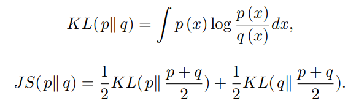
>
>KL散度不对称，KL散度$KL(p||q)∈[0,+\infin]$；JS散度对称（$p$，$q$互换值不变），JS散度$JS(𝑝 || q) ∈ [0, \log2]$为有界函数
>

*为什么在每一轮训练中$G$​不能训练太多？*

生成器$G$的优化函数是在最优判别器的情况下得到的，当$G$训练的太强时此时的判别器就不是最优判别器了，此时去优化这个目标函数也就不是在优化两个分布之间的JS散度了。所以为了让目标函数尽量保持不变，应该让G不要训练太多

##### Non-saturating generator  loss

对于Non-saturating GAN，我们把生成器的损失函数$\mathbb{E}_{\boldsymbol{x} \sim p_{\text{g}}(\boldsymbol{x})}[\log (1-D(\boldsymbol{x}))]$改为$\mathbb{E}_{\boldsymbol{x} \sim p_{\text{g}}(\boldsymbol{x})}[-\log (D(\boldsymbol{x}))]$

The non-saturating game is heuristic, not being motivated by theory. However, the non-saturating game has other problems such as unstable numerical gradient for training $G$.

根据上面的公式，我们有
$$
\mathbb{E}_{x \sim p_{g}}\left[\log \left(1-D_{G}^{*}(x)\right)\right]=2*JS\left(p_{\text{data}}\|p_{g}\right)-2\log2-\mathbb{E}_{x \sim p_{\text {data }}}\left[\log D_{G}^{*}(x)\right]
$$
最后两项与生成器无关，所以实际上是在最小化JS散度，又因为
$$
\begin{aligned}
&\mathbb{E}_{x \sim p_{g}}\left[-\log \left(D_{G}^{*}(x)\right)\right]+\mathbb{E}_{x \sim p_{g}}\left[\log \left(1-D_{G}^{*}(x)\right)\right] \\
&=\mathbb{E}_{x \sim p_{g}}\left[\log \frac{\left(1-D_{G}^{*}(x)\right)}{D_{G}^{*}(x)}\right]=\mathbb{E}_{x \sim p_{g}}\left[\log \frac{p_{g}(x)}{p_{\text {data }}(x)}\right] \\
&=K L\left(p_{g} \| p_{\text {data }}\right)
\end{aligned}
$$
所以
$$
\begin{aligned}
&\mathbb{E}_{x \sim p_{g}}\left[-\log \left(D_{G}^{*}(x)\right)\right] \\
&=K L\left(p_{g} \| p_{\text {data }}\right)-2*JS\left(p_{\text{data}}\|p_{g}\right)+2\log2+\mathbb{E}_{x \sim p_{\text {data }}}\left[\log D_{G}^{*}(x)\right]
\end{aligned}
$$
最后两项与 G 无关不用管，对非饱和博弈中的替代 G 损失函数的优化是矛盾的，因为第一项目标是使生成的分布与实际分布之间的差异尽可能小，而由于负号的存在，第二项目标是使得这两个分布之间的差异尽可能大。这将为训练 G 带来不稳定的数值梯度。

其中JS散度$JS(𝑝_g , p_{data} ) ∈ [0, \log 2]$​为有界函数，因此生成网络的目标更多的是受逆向KL散度$KL(𝑝_g||𝑝_{data})$​影响，使得生成网络更倾向于生成一些更“安全”的样本， 从而造成模型坍塌（Model Collapse）问题。

此外，我们知道 KL 不是对称的，对于生成器无法生成真实样本的情况，KL 对 loss 的贡献非常大，而对于生成器生成的样本多样性不足的时候，KL 对 loss 的贡献非常小。

##### Model Collapse

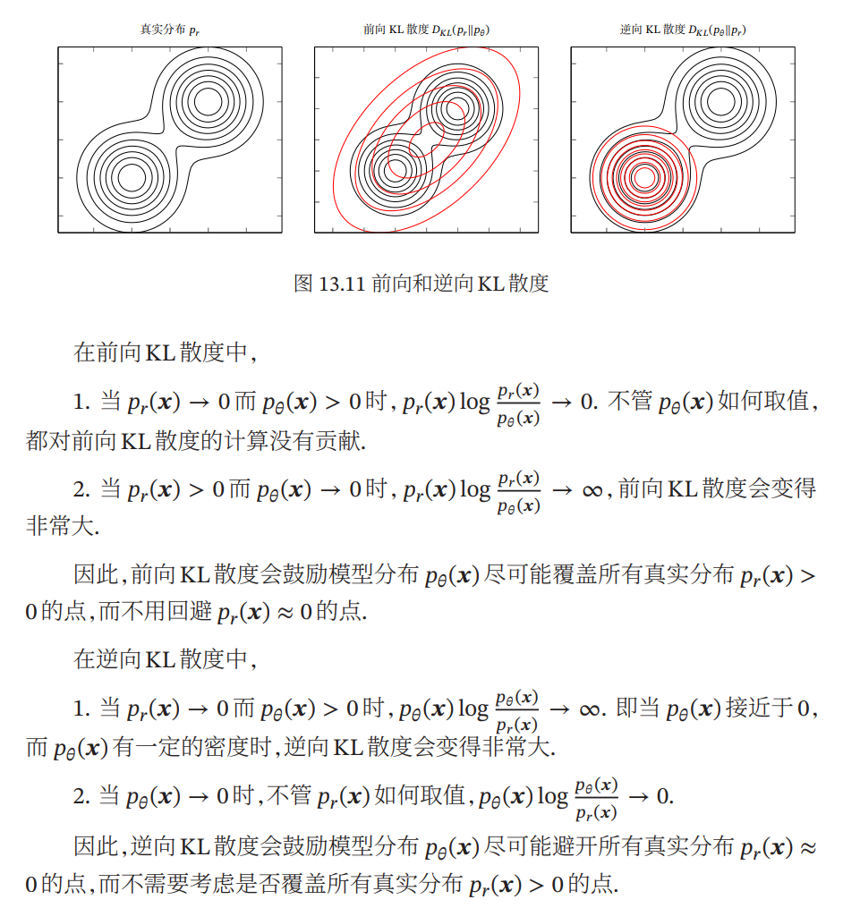

##### Mode dropping

如上图，$P_{data}$​是8个高斯分布的点，也就是8个mode。
我们希望给定一个随机高斯分布，我们希望这一个随机高斯分布经过G最后可以映射到这8个高斯分布的mode上面去。但是上面第二行的图表明，我们不能映射到这8个高斯分布的mode上面，整个G只能生成同一个mode，由于G和D的对抗关系，G不断切换mode

- 在step15k的时候，G的位置在某一个Gaussian所在位置，然后D发现G只是在这个Gaussian这里了，所以就把这个地方的所有data(无论real还是fake)都给判定为fake
- G发现在这个Gaussian待不下去了，只会被D永远判定为fake（因为训练D的负样本都是G生成的这类相似的样本，所以训练出来的D会把这类样本判为负类），所以就想着换到另一个地方。在step25k就跳到了另一个Gaussian上去
- 然后不断跳跳跳，不断重复上述两个过程，就像猫捉老鼠的过程一样，然后就没有办法停下来，没法达到我们理想中映射到8个不同的Gaussian上面去

---

#### f-GAN

##### The f-divergence Family

$$
D_{f}(P \| Q) =\int_{x} q(x) f\left(\frac{p(x)}{q(x)}\right) d x
$$

where the generator function $f : \mathbb{R}_+ → \mathbb{R}$​ is a convex, lower-semicontinuous function satisfying $f(1) = 0$​.

f是一个凸函数同时 f(1)=0，并且 0 是$D_𝑓$能取到的最小值：
$$
D_{f}(P\|Q)=\int_{x} q(x) f\left(\frac{p(x)}{q(x)}\right)dx\ge f\left(\int_{x}q(x)\frac{p(x)}{q(x)}dx\right)=f(1)=0
$$

##### Fenchel Conjugate

Every convex, lower-semicontinuous function $f$ has a convex conjugate function $f^∗$ , also known as Fenchel conjugate.
$$
f^{*}(t)=\max _{x \in \operatorname{dom}(f)}\{x t-f(x)\} \quad \Leftrightarrow \quad f(x)=\max _{t \in \operatorname{dom}\left(f^{*}\right)}\left\{x t-f^{*}(t)\right\}
$$
The function $f^∗$ is again convex and lower-semicontinuous and the pair $(f, f^∗)$ is dual to another in the sense that $f^{∗∗} = f$​.

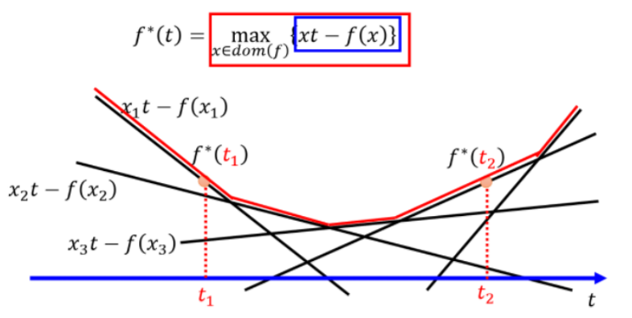

##### f-Div GAN

$$
\begin{aligned}
D_{f}(P \| Q) &=\int_{x} q(x) f\left(\frac{p(x)}{q(x)}\right) d x \\
&=\int_{x} q(x)\left(\max _{t \in d o m\left(f^{*}\right)}\left\{\frac{p(x)}{q(x)} t-f^{*}(t)\right\}\right) d x \\
& \geqslant \int_{x} q(x)\left(\frac{p(x)}{q(x)} D(x)-f^{*}(D(x))\right) d x \\
&=\int_{x} p(x) D(x) d x-\int_{x} q(x) f^{*}(D(x)) d x \\
\end{aligned}
$$

第三行将 $t$ 替换成 $D(x)$ 并将 $=$ 替换成 $⩾$ 原因是：我们要求得的是给定 $x$ 找到一 个 $t$ 使得式子最大，也就是说不管 $D(x)$​ 取什么值都一定小于或者等于第二行的式子；

我要找到一个 $D$ 使得上面最后一步中的式子最大，上界就是等于第二行的式子，即
$$
\begin{aligned}
D_{f}(P \| Q) &\approx \max _{D} \int_{x} p(x) D(x) d x-\int_{x} q(x) f^{*}(D(x)) d x\\
&=\max_{D}\{\mathbb{E}_{x\sim P}[D(x)]-\mathbb{E}_{x\sim Q}[f^*(D(x))]\}
\end{aligned}
$$
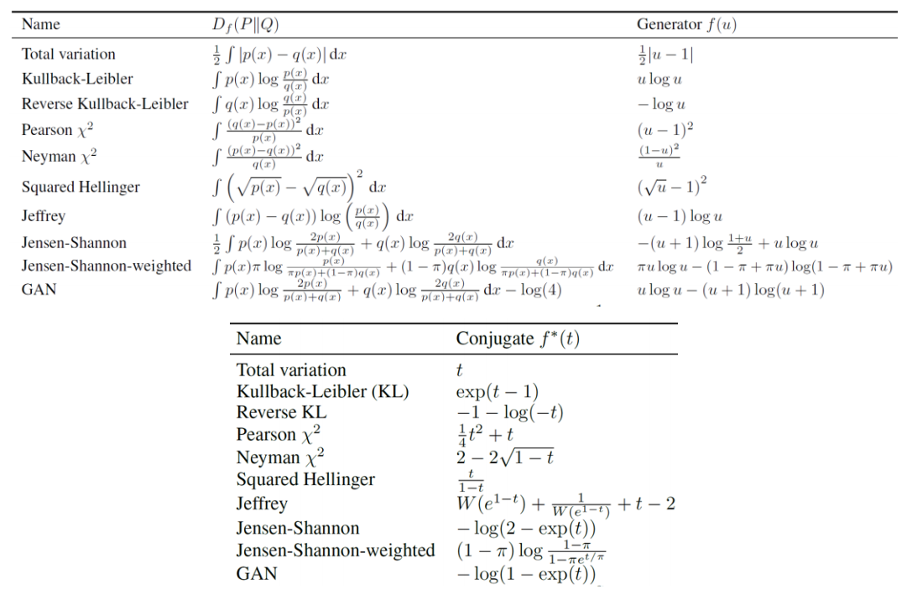

对于生成器来说，我们就是要找到一个 $𝑃_𝐺$使得:
$$
\begin{aligned}
G^{*} &=\arg \min _{G} D_{f}\left(P_{\text {data }}|| P_{G}\right) \\
&=\arg \min _{G} \max _{D}\left\{E_{x \sim P_{\text {data }}}[D(x)]-E_{x \sim P_{G}}\left[f^{*}(D(x))\right]\right\} \\
&=\arg \min _{G} \max _{D} V(G, D)
\end{aligned}
$$
*f-GAN 告诉我们的就是一句话：不只是 JS Div，任何的 Div（统称为 f-Div）都可以被放到 GANs 的架构中去。*

---

#### Improved  GAN

##### Semi-supervised learning

We can do semi-supervised learning with any standard classifier by simply adding samples from the GAN generator $G$ to our data set, labeling them with a new “generated” class $y = K + 1$, and correspondingly increasing the dimension of our classifier output from $K$ to $K + 1$. We may then use $p_{model}(y = K + 1 | x)$ to supply the probability that $x$ is fake, corresponding to $1 − D(x)$ in the original GAN framework. We can now also learn from unlabeled data, as long as we know that it corresponds to one of the $K$ classes of real data by maximizing $\log p_{model}(y ∈ {1, . . . , K}|x)$. Assuming half of our data set consists of real data and half of it is generated (this is arbitrary), our loss function for training the classifier then becomes
$$
L=L_{supervised}+L_{unsupervised}
$$

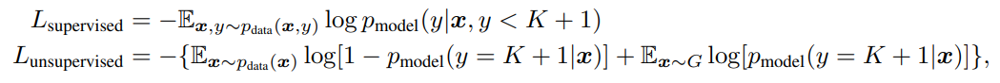

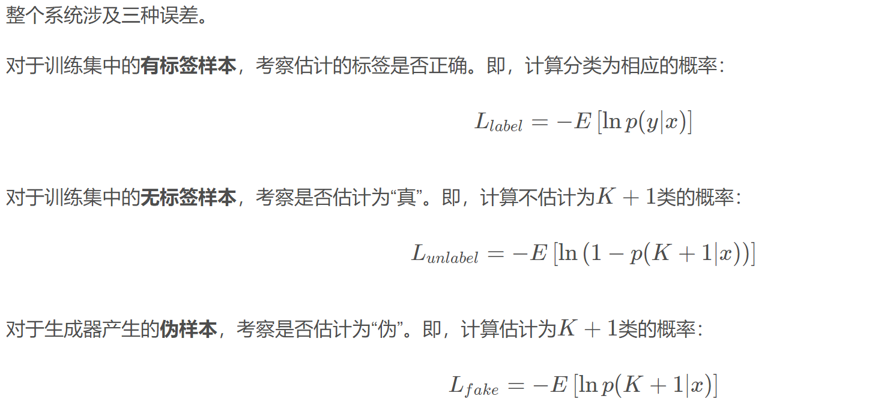

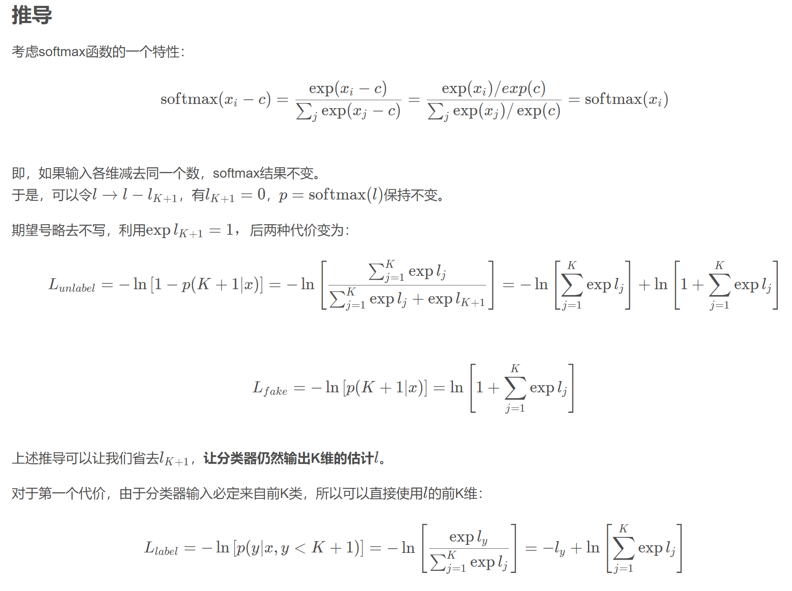

注意公式中的$l_j=l_j-l_{K+1}$

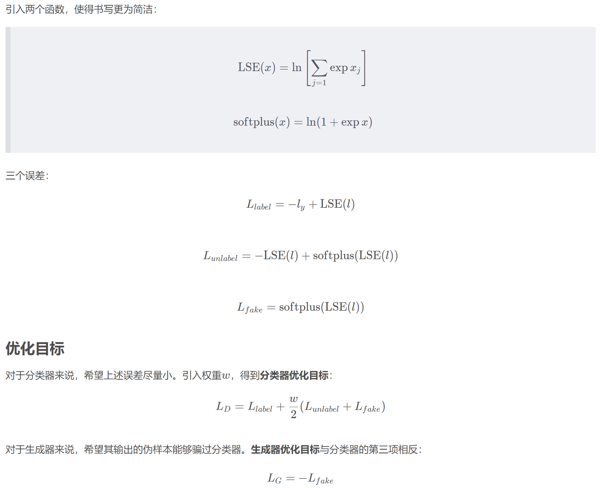

[详见这里](https://blog.csdn.net/shenxiaolu1984/article/details/75736407)

---

#### W-GAN

##### JS Div不是最佳的Div

*用JS散度作为损失函数有什么问题？*

我们先考虑一下$p_g$​​​ 与 $p_{data}$​​​的实际分布情况，我们会发现，大多数情况下 $p_g$​​​  与 $p_{data}$​​​是没有重合的。因为一方面，从理论上来说， $p_g$​​​ 与 $p_{data}$​​​都属于高维空间中的低维流形，二者具有重合的可能性是非常低的；另外一方面，从实际上来看，即算$p_g$​​​ 与 $p_{data}$​​​的分布有了重合区域（如下左图），但是在实际训练中我们是从 $p_g$​​​ 与 $p_{data}$​​​中取的采样，这些采样形成的分布很有可能是互不相交的(如下右图)，我们仍然能找到一条分割线将$p_g$​​​ 与 $p_{data}$​​​完美分割开来（如右图中的黑线）。所以我们可以认为，大多数情况下 $p_g$​​​ 与 $p_{data}$​​​是没有重合的。此外，从直觉的角度来看，前面有提到JS Div是通过判别器计算出来的，而判别器的本质是二分类器，只要$p_g$​​​与$p_{data}$​​完全没有重合，最优判别器就能很容易地鉴别出$p_g(x)$​​与 $p_{data}$​的差异，因此二者的 JS Div 就是一样的，都是$\log 2$​。（这也说明了在每一轮的训练中判别器也不能训练的太好）

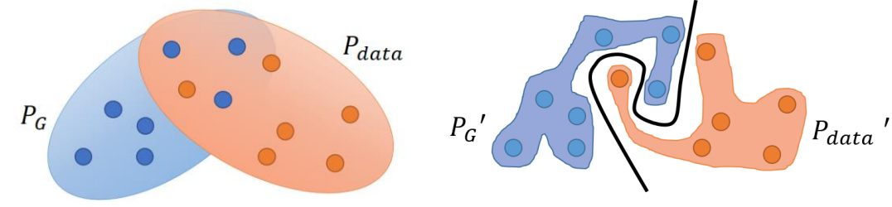

训练生成器的目标是最小化$P_g$和$P_{data}$之间的散度，先用判别器量出散度，但是对生成器来说$P_{g0}$和$P_{g1}$是一样的，因此生成器不会将$P_{g0}$更新为$P_{g1}$​。（为什么$P_{G0}$与$P_{G1}$和$P_{data}$的JS散度一样就说明训练生成器时没有梯度，因为JS散度一样所以loss是一样的所以没有梯度？反推JS散度是怎么算的，JS散度是最小化判别器的交叉熵损失算出来的，JS散度一样说明判别器的交叉熵损失一样，损失一样就说明没有梯度，但这里要让JS散度最小是要最小化生成器的损失函数啊，判别器没有梯度和生成器没有梯度没必然联系吧？还是因为原始GAN中判别器的损失函数和生成器的损失函数是一样的只是符号相反？没搞懂！）

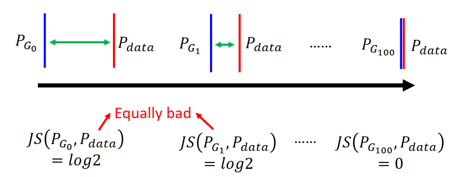

~~另外一个直观的想法是：当你learn一个二元分类器的话，会给蓝色的点0分，绿色点1分；output是sigmoid函数，在接近0或1的地方特别平，我们期待的是你train一个生成器，它会带领蓝色的点顺着梯度去移动分布，但是蓝色的点几乎是不动的，因为它的附近梯度几乎是0~~

*为什么两个分布完全没有重叠的部分，或者它们重叠的部分可忽略，它们的JS散度是$\log2$*？

因为采样任意一个x只有四种可能

- $p_{data}(x) \rightarrow 0$​ 且 $p_g(x) \rightarrow 0$​
- $p_{data}(x) \nrightarrow 0$​ 且 $p_g(x) \nrightarrow 0$​
- $p_{data}(x) \rightarrow0$ 且 $p_g(x) \nrightarrow 0$
- $p_{data}(x) \nrightarrow 0$ 且 $p_g(x) \rightarrow 0$

第一种对计算JS散度无贡献（样本不属于这两个分布中的任何一个，没有办法衡量两个分布的相似度），第二种情况由于这里重叠部分可忽略所以也无贡献，第三第四种情况代入JS散度项得到的都是$\log2$（KL散度都是$+\infin$）​​​​，而这对于梯度下降方法意味着——梯度为0！

>

总之原始GAN不稳定的原因就是：判别器训练得太好，生成器梯度消失，生成器loss降不下去；判别器训练得不好，生成器梯度不准，四处乱跑。只有判别器训练得不好不坏才行，但是这个火候又很难把握，甚至在同一轮训练的前后不同阶段这个火候都可能不一样，所以GAN才那么难训练

---

#### LS GAN

Regular GANs hypothesize the discriminator as a classifier with the sigmoid cross entropy loss function. However, we found that this loss function may lead to the vanishing gradients problem during the learning process.

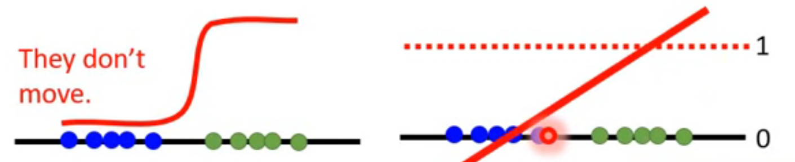

~~蓝色样本点，是生成样本𝑃𝐺，它们的得分为 0；绿色样本点，是真实样本𝑃𝑑𝑎𝑡𝑎，它们的得分 为 1；𝑃𝐺与𝑃𝑑𝑎𝑡𝑎之间完全没有交集。当轮到生成器训练的时候，它希望蓝色的点能够向右移，但是因为对于所有蓝色点，判别器计算出的 JS Div 都是一样的， 这意味着所有点的梯度都是 0，于是基于 gradient descent 所有的生成样本的点都无法移动了~~

（没搞懂）

---

#### Info GAN

[InfoGAN：Interpretable Representation Learning by Information Maximizing GANs论文解读_sdnuwjw的博客-CSDN博客](https://blog.csdn.net/sdnuwjw/article/details/83614977)
